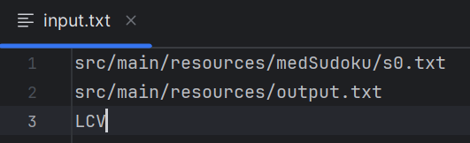
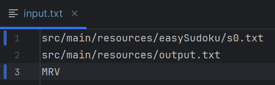
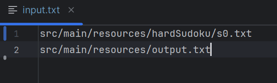
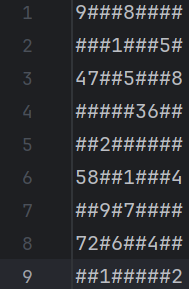
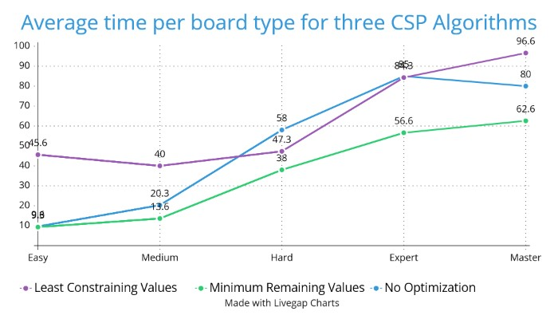

Sudoku Solver

# Organization

The program consists of four major java files. In addition, directories containing pre-built sudoku boards are provided. These directories include easy, medium, hard, expert, and master unsolved sudoku boards. From the directory root…

1.  “src/main/java/com.github.theshanachie/Main”: This is where the program's main function and class are contained. (**This should be referenced when running the program**.)
2.  “src/main/java/com.github.theshanachie/InputIO”: This file contains a class that is used to read the program input file if such a file is provided.
3.  “src/main/java/com.github.theshanachie/Sudoku”: This file contains a class that is used to solve the sudoku puzzle by the given CSP algorithm.
4.  “src/main/java/com.github.theshanachie/SudokuIO”: This is used for registering/reading the sudoku board provided by the program arguments. It is also used for displaying the sudoku board via the command line and writing the final result to a output file.

For reference, the directory structure looks as such…

“Sudoku_Solver\\src” --
```
main
├── java
│   ├── com
│   │   └── github
│   │       └── theshanachie
│   ├── InputIO.java
│   ├── Main.java
│   ├── Sudoku.java
│   └── SudokuIO.java
├── resources
│   ├── input.txt
│   ├── output.txt
│   └── Project_2.pdf
├── easySudoku
│   ├── s0.txt
│   ├── s1.txt
│   └── s2.txt
├── expertSudoku
│   ├── s0.txt
│   ├── s1.txt
│   └── s2.txt
├── hardSudoku
│   ├── s0.txt
│   ├── s1.txt
│   └── s2.txt
├── masterSudoku
│   ├── s0.txt
│   ├── s1.txt
│   └── s2.txt
└── medSudoku
    ├── s0.txt
    ├── s1.txt
    └── s2.txt

test
└── java
```
# User Manual

The program allows for several different organizations of arguments. If no arguments are given, the program will display no output and close immediately. Otherwise, the user can provide a single argument that is the path to a configuration file. This file **MUST** include two lines…

1.  \<Path to input file\>
2.  \<Path to output file\>

A third **OPTIONAL** line should contain an argument specifying the CSP optimization. The possible arguments for CSP optimizations are…

1.  ‘MRV’ – Minimum Remaining Values
2.  ‘LCV’ – Least Constraining Values

As an example, the configuration file can be organized as such…



Figure 1: Input file: medSudoku/s0.txt, Output file: output.txt, CSP Optimization: Least Constraining Value



Figure 2: Input file: easySudoku/s0.txt, Output file: output.txt, CSP Optimization: Minimum Remaining Values



Figure 3: Input file: hardSudoku/s0.txt, Output file: output.txt, CSP Optimization: None

Running the program with a specified input file should look as follows…

**C: …/Sudoku_Solver\> java -classpath \<Path to class “com.github.theshanachie.Main**” **\> \<Path to Input file\>**

If the user would like to specify configuration details without using a configuration file, the program can be given the same arguments directly via the command line when the program is run. This may look like…

**C: …/Sudoku_Solve \> java -classpath \<Path to class “com.github.theshanachie.Main**”**\> \<Path to Sudoku Board\> \<Path to Output file\> \<Optional: CSP Optimization\>**

# Sudoku Board Format

All sudoku boards passed to the program should be in a readable .txt file. The program has not been tested with other file formats, and the output may be unpredictable if the proper format is not provided. The proper format for all sudoku board files passed to the program must…

1.  Contain exactly nine lines of text.
2.  Contain exactly nine characters per line of text.
3.  Be comprised of only the character ‘\#’ and the digits ‘1-9’.
4.  Use the digits ‘1-9’ to represent pre-filled board values.
5.  Use the character ‘\#’ to represent unfilled board values.

As an example of the board format, a file representing a valid board can look as follows in Figure 4. This allows the program to read the 7th character in the 9th row to determine what exists in the grid that the sudoku board represents.



Figure 4: File containing a sudoku board represented in a valid way.

# Performance

Since I had some issues testing the program with just easy through hard sudoku boards, I additionally added expert and master sudoku boards, which my program seems to handle adequately. In the three annotations below, I label the runtime of my program while attempting to solve boards of each type. There are three boards of each type in this case. The first annotation uses no CSP optimization besides simple backtracking. The second shows runtimes while using the minimum remaining values optimization. The last shows the runtimes while using the least constraining value optimization.

No CSP optimization

| None       | Easy  | Medium | Hard  | Expert | Master |
|------------|-------|--------|-------|--------|--------|
| Board \#1  | 11ms  | 4ms    | 67ms  | 82ms   | 97ms   |
| Board \#2  | 13ms  | 53ms   | 97ms  | 131ms  | 81ms   |
| Board \#3  | 5ms   | 4ms    | 10ms  | 42ms   | 62ms   |
| Total Time | 29ms  | 61ms   | 174ms | 255ms  | 240ms  |
| Avg. time  | 9.6ms | 20.3ms | 58ms  | 85ms   | 80ms   |

Minimum Remaining Value Optimization

| MRV        | Easy  | Medium | Hard  | Expert | Master |
|------------|-------|--------|-------|--------|--------|
| Board \#1  | 8ms   | 8ms    | 33ms  | 133ms  | 77ms   |
| Board \#2  | 9ms   | 7ms    | 66ms  | 20ms   | 11ms   |
| Board \#3  | 11ms  | 26ms   | 15ms  | 17ms   | 100ms  |
| Total Time | 28ms  | 41ms   | 114ms | 170ms  | 188ms  |
| Avg. time  | 9.3ms | 13.6ms | 38ms  | 56.6ms | 62.6ms |

Least Constraining Value Optimization

| LCV        | Easy   | Medium | Hard   | Expert | Master |
|------------|--------|--------|--------|--------|--------|
| Board \#1  | 46ms   | 52ms   | 43ms   | 172ms  | 129ms  |
| Board \#2  | 33ms   | 29ms   | 70ms   | 50ms   | 37ms   |
| Board \#3  | 58ms   | 39ms   | 29ms   | 31ms   | 124ms  |
| Total Time | 137ms  | 120ms  | 142ms  | 253ms  | 290ms  |
| Avg. time  | 45.6ms | 40ms   | 47.3ms | 84.3   | 96.6ms |



The above graph shows the average runtimes of each solution technique included in the program while attempting to solve boards of different difficulties. The blue line gives a baseline for how simple backtracking will find solutions to 9 by 9 sudoku problems. In comparison, the program solves the sudokus \~1/3 times faster with the minimum remaining value optimization. Lastly, but importantly, we can see that the program’s runtime is inconsistent while using the least constraining values optimization. Upon initial analysis, I was under the impression that the runtime of the program would plateau when solving easy solutions due to the complexity of this optimization but climb slower as the problems become more complex. To research this assumption, I tested the program with expert and master sudoku boards. This allows us to see that the LCV optimization implemented is adding complexity to the program by calculating the domains of 21 different board locations per search. To fix this issue, it would be pertinent to calculate an initial domain for the board and update domains appropriately throughout the program instead of re-calculating the domains each program iteration.
